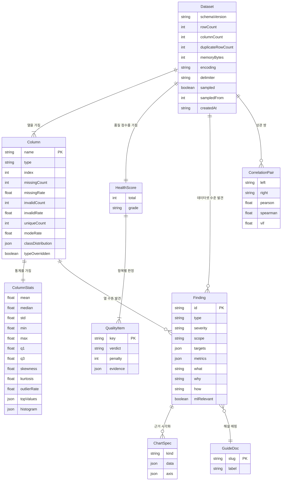
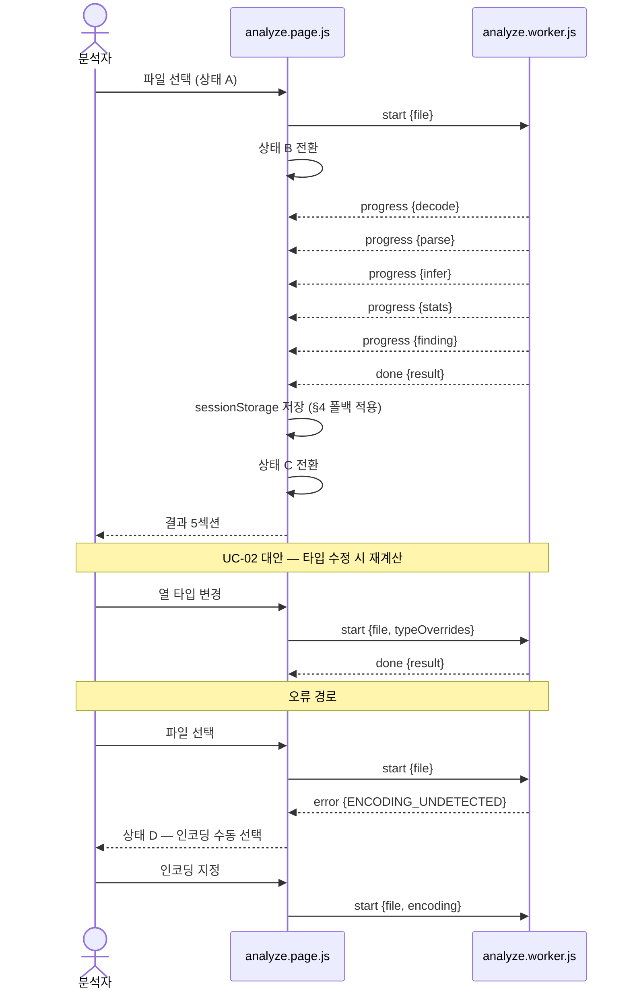
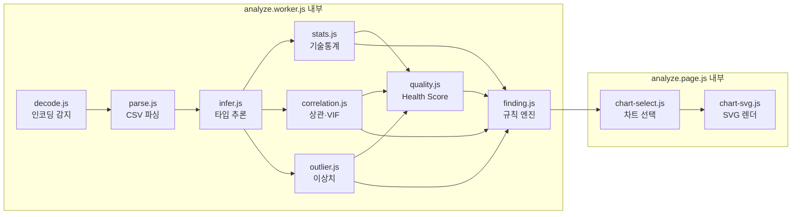

# 데이터 모델

- 작성일: 2026-08-16
- 전제: [`use-cases.md`](./use-cases.md) UC-01~11, [`screens.md`](./screens.md) 화면·상태, [`tech-stack.md`](./tech-stack.md) 모듈 구조
- **이 문서가 단일 원천인 것**: 결과 JSON 스키마, 저장소 키 스키마, Worker 메시지 프로토콜, 모듈 의존 방향

---

## 1. 이 문서의 위치

이 프로젝트에는 데이터베이스가 없음. 따라서 **테이블·외래키·정규화를 다루는 물리 ERD가 아니라, 통계 JSON이라는 계약의 개념 모델**임.

계약이 필요한 이유는 통계 JSON이 **4개 경계를 넘기** 때문임.

| 경계 | 사용처 |
|---|---|
| Worker → Presentation | `analyze.worker.js`가 만들어 `analyze.page.js`로 전달 (§5) |
| 규칙 엔진 입력 | `quality.js`·`finding.js`가 이 구조를 읽어 판정 ([`rules.md`](./rules.md)) |
| 내보내기·불러오기 파일 | UC-09·UC-10. **버전 검증 대상** |
| sessionStorage 캐시 | 해설 페이지 왕복 시 결과 복원 (§4) |

한 곳에서 필드를 바꾸면 네 곳이 깨지므로 스키마를 여기 고정함.

## 2. 개념 엔티티 다이어그램



**핵심 제약 3건**

1. **`Dataset`은 행 데이터를 갖지 않음.** 집계값만 보유하며 미리보기 행도 스키마에 없음 — 화면 표시용 미리보기는 파싱 직후 메모리에서만 소비하고 결과 객체에 넣지 않음 (UC-09 규칙)
2. **`Finding`은 `Column`에 optional로 연결됨.** 열 하나를 대상으로 하는 발견(편포)과 데이터셋 전체를 대상으로 하는 발견(중복 행)이 함께 있으므로 `scope` 필드로 구분하고 `targets`에 대상 열 이름 배열을 담음
3. **`GuideDoc`은 결과 JSON에 포함되지 않음.** `finding-map.json`(§7)을 통해 런타임에 조회되는 외부 참조임. 결과 파일이 해설 구조 변경에 영향받지 않게 하기 위함

## 3. 결과 JSON 스키마

### 3.1 최상위

```json
{
  "schemaVersion": "1.0",
  "dataset": { },
  "columns": [ ],
  "health": { },
  "findings": [ ],
  "correlations": [ ]
}
```

| 경로 | 타입 | 필수 | 설명 |
|---|---|:---:|---|
| `schemaVersion` | string | ○ | `major.minor`. UC-10이 검증. major 불일치는 거부 |
| `dataset` | object | ○ | §3.2 |
| `columns` | array | ○ | §3.3. 원본 열 순서 |
| `health` | object | ○ | §3.4 |
| `findings` | array | ○ | §3.5. 빈 배열 허용 |
| `correlations` | array | ○ | §3.6. 수치형 열 2개 미만이면 빈 배열 |

### 3.2 `dataset`

| 필드 | 타입 | 필수 | 설명 |
|---|---|:---:|---|
| `rowCount` | int | ○ | 분석에 사용한 행 수 |
| `columnCount` | int | ○ | |
| `duplicateRowCount` | int | ○ | 완전 중복 행 수 |
| `memoryBytes` | int | ○ | 추정치 |
| `encoding` | string | ○ | `utf-8` \| `euc-kr`. 감지 결과 또는 사용자 지정 |
| `delimiter` | string | ○ | |
| `sampled` | boolean | ○ | Phase 2의 샘플링 여부. Phase 1은 항상 `false` |
| `sampledFrom` | int | △ | `sampled`가 `true`일 때만 |
| `createdAt` | string | ○ | ISO 8601 |

`fileName`·`fileSize`는 **담지 않음** — 결과 파일을 공유할 때 원본 파일명이 새어나가지 않게 함.

### 3.3 `columns[]`

| 필드 | 타입 | 필수 | 설명 |
|---|---|:---:|---|
| `name` | string | ○ | 식별자. **인덱스가 아니라 이름으로 참조**해 열 순서 변경에 견딤 |
| `index` | int | ○ | 원본 위치(표시용) |
| `type` | string | ○ | `numeric` \| `categorical` \| `datetime` \| `boolean` \| `id` \| `text` |
| `typeOverridden` | boolean | ○ | 사용자가 UC-02 대안 흐름으로 바꿨는지 |
| `missingCount` / `missingRate` | int / float | ○ | |
| `invalidCount` / `invalidRate` | int / float | ○ | 추론된 타입으로 변환되지 않는 값의 수·비율. Health Score `invalid` 항목의 입력 ([`rules.md §2.1`](./rules.md)) |
| `uniqueCount` | int | ○ | |
| `modeRate` | float | ○ | 최빈값이 차지하는 비율. **모든 타입에서 산출.** Health Score `constant`와 `F-CONST-COL`의 입력 |
| `classDistribution` | object | △ | `{값: 빈도}` 전체 분포. **타깃 열로 지정된 열에만 채워짐**(Phase 2). `F-CLASS-IMBALANCE`의 입력 |
| `stats` | object | ○ | §3.7. 타입에 따라 채워지는 필드가 다름 |

`invalidCount`는 결측과 구분됨 — 빈 값은 `missingCount`, `age` 열의 `"미상"` 처럼 값이 있으나 타입에 맞지 않는 것은 `invalidCount`로 셈. 두 수를 합해도 전체 행 수를 넘지 않음.

**`modeRate`를 `stats` 하위가 아니라 여기 두는 이유**: `stats`는 타입에 따라 채워지는 필드가 달라지는 영역인데 최빈값 비율은 모든 타입에서 동일하게 정의되고 세 규칙(Health `constant` · `F-CONST-COL` · 타입 추론 근거 노출)이 함께 씀. 타입 분기 밖에 두어야 규칙이 타입을 신경 쓰지 않아도 됨. 특히 **수치형 준상수**(상태코드 열의 99%가 동일한 경우 등)를 `stats.topValues` 없이 판정할 수 있게 하는 것이 목적임.

**`classDistribution`이 `topValues`와 다른 점**: `topValues`는 상위 N개만 담아 **최소 클래스가 잘림.** 클래스 불균형은 최소 클래스 비율로 판정하므로 전체 분포가 필요함.

동명 열이 있으면 파싱 단계에서 `name`, `name_2`로 구분해 이름 참조의 유일성을 보장함.

### 3.4 `health`

| 필드 | 타입 | 설명 |
|---|---|---|
| `total` | int | 0~100 |
| `grade` | string | `good` \| `fair` \| `poor` |
| `items[]` | array | 항목별 판정 |
| `items[].key` | string | `missing` \| `duplicate` \| `constant` \| `cardinality` \| `outlier` \| `invalid` |
| `items[].verdict` | string | `ok` \| `warn` \| `bad` |
| `items[].penalty` | int | 실제 감점값 |
| `items[].evidence` | object | 판정 근거 수치 (화면에 노출) |

감점 계산식은 [`rules.md §2`](./rules.md)가 단일 원천임.

### 3.5 `findings[]`

| 필드 | 타입 | 설명 |
|---|---|---|
| `id` | string | 이 결과 내 유일. `{type}#{순번}` |
| `type` | string | `rules.md §3`의 Finding 유형 ID (예 `F-MULTICOLLINEAR`) |
| `severity` | string | `high` \| `medium` \| `low` |
| `scope` | string | `dataset` \| `column` \| `pair` |
| `targets` | string[] | 대상 열 이름. `dataset` 범위면 빈 배열 |
| `metrics` | object | 문구 템플릿에 주입되는 수치 |
| `what` / `why` / `how` | string | 3단 해석 (축 1). 생성 시점에 문구를 확정해 담음 |
| `mlRelevant` | boolean | ML 관점 경고 여부 |

`what`·`why`·`how`를 **문자열로 확정해 담는 이유**: 결과 파일을 나중에 열었을 때(UC-10) 규칙 버전이 달라져도 당시 해석이 그대로 재현되어야 함. 템플릿 ID만 담으면 재현성이 깨짐.

### 3.6 `correlations[]`

| 필드 | 타입 | 설명 |
|---|---|---|
| `left` / `right` | string | 열 이름 |
| `pearson` / `spearman` | float | `null` 허용(계산 불가 시) |
| `vif` | float | 좌측 열의 VIF. `null` 허용 |
| `points` | array | 선택(△). 산점도용 다운샘플 점 `[[x, y], …]`. **상관 절댓값 상위 쌍**([`rules.md §4`](./rules.md) 산점도 상한)에만, 쌍당 점 수 상한까지 담음. 용량 폴백 2단계에서 제거됨(§4) |

전체 행렬을 담지 않고 **쌍 배열로 담음** — 열 30개면 행렬은 900칸이지만 상삼각 쌍은 435개이고, 임계값 미달 쌍을 제외하면 더 줄어듦. 히트맵은 이 배열로 재구성함.

`points`가 필요한 이유: 결과 JSON에는 원본 행이 없으므로(§3.2) 산점도(UC-08)를 그릴 점이 어디에도 없음. 집계만으로는 계산 불가능한 유일한 화면 요소라 상위 쌍에 한해 다운샘플을 담음 — 원본 행 전체가 아니라 두 열의 값 쌍만이며, 표시 상한이 개수를 제한함.

### 3.7 `stats` — 타입별 채워지는 필드

| 타입 | 채워지는 `stats` 필드 |
|---|---|
| `numeric` | `mean` `median` `std` `min` `max` `q1` `q3` `skewness` `kurtosis` `outlierRate` `histogram` |
| `categorical` | `topValues`(값·빈도 배열) |
| `datetime` | `min` `max` `histogram`(구간별 건수) |
| `boolean` | `topValues` |
| `id` / `text` | 없음 (통계를 산출하지 않음) |

`histogram`은 `{binEdges: number[], counts: number[]}`. **§4의 용량 폴백에서 가장 먼저 제외되는 항목임.**

> **타입과 무관하게 채워지는 필드는 `stats` 밖에 있음** — `missingRate`·`invalidRate`·`uniqueCount`·`modeRate`는 `id`·`text`를 포함한 모든 타입에서 산출됨(§3.3). 위 표는 `stats` 하위만 다룸. 따라서 `F-CONST-COL`처럼 타입을 가리지 않는 규칙은 `stats`를 보지 않고 `columns[]` 공통 필드만 참조해 성립함.

## 4. 저장소 키 스키마

| 키 | 저장소 | 내용 | 수명 |
|---|---|---|---|
| `autoeda:result` | sessionStorage | §3 결과 JSON 전문 | 탭 종료 시 소멸 |
| `autoeda:prefs` | localStorage | `{activeTab, selectedColumn, corrMethod}` | 영구 |
| 원본 파일 | **저장하지 않음** | — | 메모리에서 처리 후 폐기 |

**sessionStorage인 이유**: 축 6의 `결과 → 해설 → 복귀` 왕복(UC-15)에서 결과가 유지되어야 함. 탭을 닫으면 사라지는 편이 데이터 성격에 맞으므로 localStorage를 쓰지 않고, 표시 설정만 영구 보관함.

### 용량 초과 폴백 (3단계)

sessionStorage 한도는 대략 5MB임. 열이 많으면 `histogram`과 `correlations`가 커질 수 있음.

1. `stats.histogram`을 제외하고 재시도 → 복원 시 분포 차트만 다시 계산 필요
2. `correlations`를 임계값 이상 쌍으로 축소하고 산점도용 `points`(§3.6)를 제거한 뒤 재시도
3. 그래도 실패하면 **캐시를 포기하고 화면에 안내함** — "해설을 보고 돌아오면 다시 분석해야 함"

조용히 실패해 복귀 시 빈 화면을 보여주지 않음. 어느 단계에서 축소됐는지 결과 화면에 표시함.

### 스키마 버전 정책

- `minor` 증가: 필드 추가. 이전 파일을 읽을 수 있음
- `major` 증가: 필드 삭제·의미 변경. **UC-10에서 거부하고 이유를 제시함**
- `autoeda:result`와 내보내기 파일은 같은 스키마·같은 버전 필드를 씀

## 5. Worker 메시지 프로토콜

`analyze.page.js`와 `analyze.worker.js` 사이의 계약임. 메시지 5종.

| 방향 | 타입 | 페이로드 |
|---|---|---|
| Page → Worker | `start` | `{file, encoding?, typeOverrides?}` |
| Page → Worker | `cancel` | — |
| Worker → Page | `progress` | `{stage, ratio}` — `stage`는 `decode`·`parse`·`infer`·`stats`·`finding` |
| Worker → Page | `done` | `{result}` — §3 결과 JSON |
| Worker → Page | `error` | `{code, detail}` — §5.1 |



**타입 수정 시 `start`를 다시 보내는 이유**: 원본 파일 핸들이 Page 쪽에 남아 있으므로 Worker를 재기동해 처음부터 계산하는 편이 부분 재계산보다 단순하고, 파싱 결과를 Page로 넘겨 보관할 필요가 없어짐(메모리 이중 보유 회피).

### 5.1 오류 코드

`screens.md §4` 상태 D의 4유형과 1:1로 대응함.

| 코드 | 상태 D 유형 | 사용자 조치 |
|---|---|---|
| `ENCODING_UNDETECTED` | 인코딩 감지 실패 | 인코딩 수동 선택 후 재시도 |
| `FILE_TOO_LARGE` | 크기 초과 | 행 수 축소 또는 열 선택 |
| `PARSE_FAILED` | 파싱 불가 | 문제 행 위치를 보고 원본 수정 |
| `SCHEMA_MISMATCH` | 스키마 불일치 | UC-10 경로. 다른 파일 선택 |

`SCHEMA_MISMATCH`는 Worker가 아니라 Page의 불러오기 경로에서 발생하지만, 상태 D가 오류를 한 곳에서 처리하도록 같은 코드 체계를 씀.

### 5.2 취소 처리

`cancel`을 받으면 Worker는 현재 단계를 중단하고 응답 없이 종료함. Page는 Worker를 `terminate()`하고 상태 A로 복귀함 — 중단 시점의 부분 결과를 쓰지 않음(부분 통계는 틀린 통계임).

## 6. 모듈 의존 그래프



**계약 3건**

1. **단방향 · 순환 금지.** 위 그래프는 DAG임. `chart-svg`가 `stats`를 역참조하지 않도록 필요한 값은 `ChartSpec`(§2)에 담아 전달함
2. **`js/domain/*`는 DOM·`fetch`·`localStorage`를 참조하지 않음** — `tech-stack.md §5`의 계약. 그래프 상 모든 노드가 순수 함수 모듈이며 `node --test`로 검증 가능해야 함
3. **`chart-select`·`chart-svg`는 Presentation에서 호출되지만 `js/domain/`에 위치함** — 차트 선택 로직은 타입·통계에 기반한 판단이므로 순수 함수이고, SVG 문자열 생성도 DOM API를 쓰지 않으면 순수 함수로 유지됨. `document.createElement`를 쓰지 않고 문자열을 반환하는 방식으로 구현함

## 7. `finding-map.json` 스키마

UC-15가 조회하는 Finding 유형 → 해설 매핑임.

```json
{
  "F-MULTICOLLINEAR": { "slug": "multicollinearity", "label": "다중공선성" },
  "F-SKEW":           { "slug": "skewness",         "label": "왜도와 변환" }
}
```

| 필드 | 설명 |
|---|---|
| 키 | Finding 유형 ID ([`rules.md §3`](./rules.md)) |
| `slug` | `/pages/guide/{slug}` 경로에 쓰임 |
| `label` | `자세히` 링크에 표시할 이름 |

**매핑에 없는 Finding 유형은 `자세히` 링크를 렌더하지 않음**(UC-15 대안 흐름). 빈 링크를 만들지 않기 위함. K군 3편(진행 순서·인코딩·공공데이터 함정)은 프로세스 문서라 이 파일에 등장하지 않음 — 상세는 `rules.md §3`의 비대칭 설명 참조.

## 8. 개방 이슈

| 항목 | 내용 |
|---|---|
| 열 수 상한 | 열이 매우 많으면 `columns[]`와 `correlations[]`가 함께 커짐. 상한을 두고 초과 시 열 선택을 요구할지 결정 필요 |
| `ChartSpec` 표현 범위 | 5종 차트가 공유할 축·스케일 표현을 어디까지 일반화할지. 구현 착수 시 확정 |
| 스키마 버전 승격 시점 | Phase 2에서 타깃 분석 필드가 추가되면 `1.1`인지 `2.0`인지 — 필드 추가만이면 `1.1` |
| `classDistribution` 크기 상한 | 타깃 열의 고유값이 매우 많으면(고카디널리티 타깃) 분포 객체가 커짐. 상한을 두고 초과 시 타깃 지정을 거부할지, 하위 클래스를 묶을지 결정 필요 |
| `invalid` 항목 정의 | Health Score의 "유효하지 않은 값"을 어디까지 볼지(음수 나이, 미래 날짜 등)는 `rules.md §6`의 미확정 항목 |
