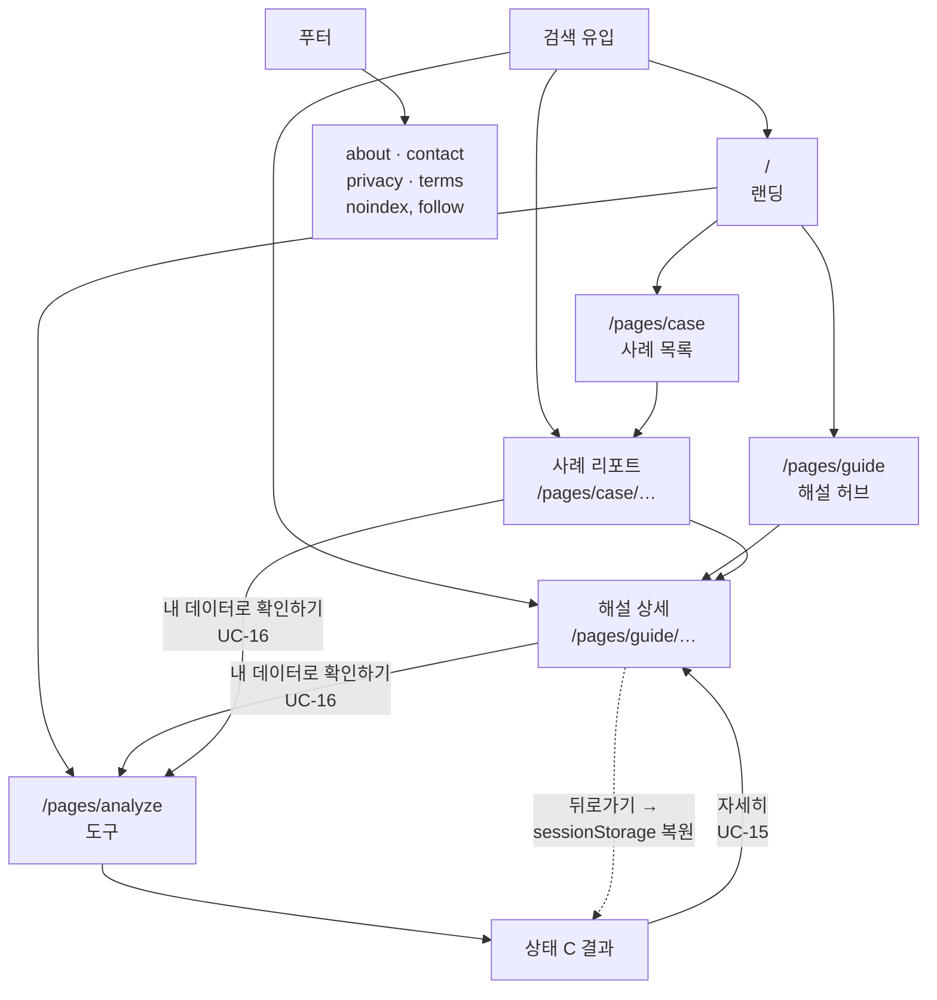

# 화면 설계

- 작성일: 2026-08-16
- 전제: [`use-cases.md`](./use-cases.md) 유스케이스, [`tech-stack.md`](./tech-stack.md) 디렉토리·배포, [`content-strategy.md`](./content-strategy.md) 콘텐츠·색인 정책
- 범위: 페이지 구분, 페이지별 기능, 도구 화면 상태, 상태 저장, 공통 요소

> **광고·색인 정책의 단일 원천은 [`content-strategy.md §4`](./content-strategy.md)임.** 아래 §2의 색인·광고 열은 그 표를 페이지 단위로 옮긴 뷰이며, 상충하면 `content-strategy.md`를 따름.

---

## 1. URL 규칙

| 규칙 | 내용 |
|---|---|
| **확장자 없음** | 내부 링크·canonical·sitemap·네비게이션 전부. `.html`을 가리키면 호스트가 307 리디렉션하고 GSC가 색인을 거부함 ([`tech-stack.md §6`](./tech-stack.md)) |
| 소문자 하이픈 | `csv-encoding`, `house-price` |
| 주제 기반 슬러그 | 해설·사례는 번호가 아니라 개념명. `guide/Q1` 아님 |
| 쿼리스트링 미사용 | 도구가 단일 페이지 4상태이므로 상태를 URL로 구분하지 않음 (§4) |

## 2. 페이지 목록 (12종)

| URL | 역할 | 생성 | 색인 | 광고 | sitemap |
|---|---|---|:---:|:---:|:---:|
| `/` | 랜딩 — 도구 진입 + 콘텐츠 허브 | 수기 | ○ | ○ | ○ |
| `/pages/analyze` | **도구 (4상태)** | 수기 | ○ | × | ○ |
| `/pages/guide` | 해설 허브 — K1 본문 + 21편 목록 | 빌드 | ○ | ○ | ○ |
| `/pages/guide/{slug}` | 해설 21편 | 빌드 | ○ | ○ | ○ |
| `/pages/case` | 사례 목록 + 사례 읽는 법 | 빌드 | ○ | ○ | ○ |
| `/pages/case/{slug}` | 사례 리포트 6편 | 빌드(Python) | ○ | ○ | ○ |
| `/pages/glossary` | 용어집 (Phase 3) | 빌드 | ○ | ○ | ○ |
| `/pages/about` | 소개 | 수기 | `noindex,follow` | × | × |
| `/pages/contact` | 문의 (mailto) | 수기 | `noindex,follow` | × | × |
| `/pages/privacy` | 개인정보처리방침 | 수기 | `noindex,follow` | × | × |
| `/pages/terms` | 이용약관 | 수기 | `noindex,follow` | × | × |
| `/404` | 404 | 수기 | × | × | × |

### 설계 결정 3건

1. **`/pages/guide` 인덱스에 K1 본문을 합침** — 목록만 있는 인덱스는 thin content가 되어 안티패턴 #3에 걸림. `content-strategy.md §2.5`의 K1(EDA 진행 순서 체크리스트)이 이미 hub-and-spoke의 허브 문서이므로 이를 인덱스 본문으로 삼음. 결과적으로 해설 22편 = **인덱스 1편(K1) + 하위 21편**임
2. **`/pages/case` 인덱스도 "사례 읽는 법" 해설을 함께 둠** — 같은 이유
3. **`result` 페이지를 만들지 않음** — 백엔드가 없어 파싱 결과가 메모리에만 있으므로 페이지 이동 시 소실됨. 도구는 단일 페이지 4상태로 구성함 (§4)

### 해설 슬러그 대응

`content-strategy.md §2`의 인벤토리와 1:1로 대응함.

| 군 | 코드 → 슬러그 |
|---|---|
| 데이터 품질 | Q1 `missing-types` · Q2 `missing-imputation` · Q3 `duplicate-rows` · Q4 `constant-columns` · Q5 `high-cardinality` · Q6 `id-columns` |
| 분포 | D1 `skewness` · D2 `kurtosis` · D3 `outlier-methods` · D4 `outlier-removal` · D5 `histogram-bins` |
| 관계 | R1 `correlation-coefficients` · R2 `multicollinearity` · R3 `correlation-causation` · R4 `categorical-numeric-relation` · R5 `data-leakage` |
| 타깃·모델링 | T1 `class-imbalance` · T2 `target-distribution` · T3 `scaling` |
| 프로세스·한국 환경 | **K1 → `/pages/guide` 인덱스 본문** · K2 `csv-encoding` · K3 `korean-public-data` |

사례: C1 `titanic` · C2 `house-price` · C3~C6 국내 공공데이터(슬러그 미정 — 데이터셋 확정 시 부여).

## 3. 페이지별 기능 명세

각 페이지를 8항목 고정 서식으로 기술함. **「초기 HTML 필수 내용」** 항목은 안티패턴 #7(콘텐츠를 JSON+JS로만 렌더 → HTML에 "불러오는 중"만 남음)을 페이지 단위로 막기 위한 것임.

### 3.1 `/` 랜딩

| 항목 | 내용 |
|---|---|
| 목적 | 서비스 성격을 한 화면으로 전달하고 도구·콘텐츠 두 경로로 분기 |
| 진입 경로 | 직접 방문, 브랜드 검색, 내부 링크 전역 |
| 담당 UC | — (진입점) |
| **초기 HTML 필수** | 서비스 한 줄 소개, 무엇을 진단하는지(분석 항목 요약), 처리 방식(브라우저 내 완결·업로드 없음), 해설·사례 대표 항목 링크, FAQ |
| 화면 구성 | 히어로 + `내 데이터 분석하기` CTA / 분석 항목 요약 카드 / 해설 대표 6편 / 사례 대표 3편 / FAQ / 푸터 |
| JS 모듈 | `app/common.js` (헤더·메뉴) |
| 이탈 경로 | `/pages/analyze`, `/pages/guide`, `/pages/case` |
| 비고 | 홈 본문을 정책 페이지 링크로 채우지 않음 — 안티패턴 #8. 푸터에만 둠 |

### 3.2 `/pages/analyze` 도구

| 항목 | 내용 |
|---|---|
| 목적 | 로컬 CSV를 브라우저에서 분석해 진단 결과를 제시 |
| 진입 경로 | 랜딩 CTA, 해설·사례의 `내 데이터로 확인하기`(UC-16), 전역 메뉴 |
| 담당 UC | UC-01 ~ UC-11 |
| **초기 HTML 필수** | 도구 설명, 지원 형식(CSV·인코딩), **처리 방식 — 파일이 브라우저를 벗어나지 않는다는 설명**, 크기 제한, 분석 항목 목록, 한계(할 수 없는 것), FAQ. **결과 UI는 넣지 않음** |
| 화면 구성 | §4의 4상태 |
| JS 모듈 | `app/analyze.page.js` + `worker/analyze.worker.js` + `storage/local.js` |
| 이탈 경로 | Finding의 `자세히` → 해설(UC-15), 결과 내보내기, 문의 |
| 비고 | 초기 HTML에 결과 UI가 없으므로 **`noindex`를 걸지 않고도 결과가 색인되지 않음.** 색인되는 것은 도구 설명·FAQ뿐이며 이는 유효한 콘텐츠임 |

### 3.3 `/pages/guide` 해설 허브

| 항목 | 내용 |
|---|---|
| 목적 | EDA 진행 순서를 안내하고(K1 본문) 해설 21편의 진입점을 제공 |
| 진입 경로 | 검색 유입, 랜딩, 전역 메뉴, 해설 하위 페이지의 브레드크럼 |
| 담당 UC | UC-13 |
| **초기 HTML 필수** | K1 본문 전문(EDA 진행 순서 체크리스트) + 군별 해설 목록 + 각 항목 한 줄 요약 |
| 화면 구성 | 본문(STEP 흐름 설명) / 군별 목록 5개 섹션 / `내 데이터로 확인하기` CTA / 브레드크럼 |
| JS 모듈 | `app/common.js` |
| 이탈 경로 | 해설 21편, `/pages/analyze` |
| 비고 | 목록 항목의 한 줄 요약은 해설 원자료의 첫 문장을 빌드 시 추출해 채움 |

### 3.4 `/pages/guide/{slug}` 해설

| 항목 | 내용 |
|---|---|
| 목적 | 개념 하나를 판단 기준까지 설명 |
| 진입 경로 | **검색 유입(주 경로)**, 해설 허브, Finding의 `자세히`(UC-15), 사례 리포트 |
| 담당 UC | UC-13, UC-16 |
| **초기 HTML 필수** | 본문 전문(편당 800자 이상). 런타임 fetch 없음 |
| 화면 구성 | 제목 / 한 줄 요약 / 본문 / 판단 기준 표 / 관련 해설 링크 / 이 개념이 등장하는 사례 링크 / `내 데이터로 확인하기` CTA / 브레드크럼 |
| JS 모듈 | `app/common.js` |
| 이탈 경로 | `/pages/analyze`(CTA), 관련 해설, 사례 리포트 |
| 비고 | 광고 게재 대상. CTA를 광고와 시각적으로 구분함 |

### 3.5 `/pages/case` 사례 목록 · `/pages/case/{slug}` 사례 리포트

| 항목 | 내용 |
|---|---|
| 목적 | 업로드 없이 완성된 분석 결과를 보여 도구 산출물을 판단하게 함 (데모 겸용) |
| 진입 경로 | 검색 유입, 랜딩, 해설 페이지, 전역 메뉴 |
| 담당 UC | UC-14, UC-16 |
| **초기 HTML 필수** | 목록: "사례 읽는 법" 해설 + 사례별 요약. 상세: 데이터셋 설명·출처·이용 조건 / Health Score / Finding 목록 / **해석 본문** / 한계 |
| 화면 구성 | 상세는 도구 결과 화면과 같은 섹션 순서(개요 → 품질 → 발견 → 변수별 → 관계)를 정적으로 재현 |
| JS 모듈 | `app/common.js` (정적. 차트는 빌드 시 생성된 인라인 SVG) |
| 이탈 경로 | 등장한 발견 유형의 해설, `/pages/analyze` |
| 비고 | **해석이 본문의 주(主)여야 함** — 지표 나열만이면 안티패턴 #1. 데이터셋 출처·라이선스·확인일을 반드시 명기하며, 표시 요건과 판정 기준은 [`data-sources.md §6`](./data-sources.md)가 단일 원천임(광고 게재는 상업적 사용) |

### 3.6 정책 페이지 4종

| 페이지 | 필수 내용 | 담당 UC |
|---|---|---|
| `/pages/about` | 서비스 목적, 운영 주체, 분석 방법론, 사용 라이브러리 | — |
| `/pages/contact` | 유형 선택 → 메일 제목·본문 자동 조립 → `mailto:`. 메일 앱 없을 때 주소 노출 + 복사 + 본문 미리보기 | UC-12 |
| `/pages/privacy` | **파일이 브라우저를 벗어나지 않는다는 사실**, 로컬 저장 항목(`autoeda:*`)과 삭제 방법, 쿠키, 개인화 광고 고지, 맞춤 광고 옵트아웃 링크 | — |
| `/pages/terms` | 제공 범위, 분석 결과 정확성 면책, 금지 행위 | — |

4종 모두 `noindex, follow` + sitemap 제외. 푸터 링크로만 도달함.

> `privacy`의 삭제 방법 기재는 UC-11(결과 폐기)이 실제로 구현되어야 성립함. **문구와 구현의 불일치를 만들지 않음.**

### 3.7 `/404`

없는 경로에서 스타일이 적용된 안내를 제공. `wrangler.jsonc`의 `not_found_handling: "404-page"`가 참조함. 홈·도구·해설 허브로 가는 링크를 둠.

## 4. 도구 화면 4상태

```text
   ┌───────────────── 새 파일 / 결과 지우기 ──────────────────┐
   ▼                                                          │
[A] 파일 선택 ──선택──▶ [B] 진행(Worker) ──완료──▶ [C] 결과 ───┘
   ▲                          │
   │                          ▼
   └────── 다시 시도 ──────[D] 오류
```

| 상태 | 화면 | 구성 요소 |
|---|---|---|
| **A** 초기 | 파일 선택 | 파일 선택·드래그 앤 드롭 영역 / `결과 불러오기`(UC-10) / 도구 설명·FAQ(초기 HTML) / sessionStorage에 결과가 있으면 **`이어보기`** 제시 |
| **B** 진행 | 진행률 | 단계 표시(디코드 → 파싱 → 타입 추론 → 통계 → 발견) / 진행률 / 취소 |
| **C** 결과 | 5섹션 **탭 전환** | 개요 / 품질 / 발견 / 변수별 / 관계 + `결과 내보내기`·`결과 지우기`·`새 파일` |
| **D** 오류 | 오류 안내 | 유형별 안내 — 인코딩 감지 실패(**인코딩 수동 선택 제시**) / 크기 초과 / 파싱 불가(문제 행 위치) / 스키마 불일치(문제 필드) |

**탭 전환을 택한 이유**: 5섹션을 한 화면에 쏟으면 G2(정보 과부하)를 그대로 반복함. 사전조사가 지적한 "50개 변수 → 히스토그램 50개" 문제를 화면 구조 차원에서 막음. Phase 2의 STEP 가이드(UC-20)는 이 탭 위에 진행 모드로 얹으며 별도 페이지를 만들지 않음.

**각 탭의 표시 개수 상한은 [`rules.md §4`](./rules.md)가 단일 원천임** — 발견 목록 기본 15건, 변수별 초기 차트 8열, 산점도 6쌍, 히트맵 20열. 수치를 여기 옮겨 적지 않고 참조함.

**상태와 URL**: 4상태 모두 `/pages/analyze` 하나를 씀. 브라우저 뒤로가기는 페이지 간 이동에만 작용하고 상태 전환에는 개입하지 않음 — 상태를 히스토리에 넣으면 뒤로가기로 결과가 사라지는 혼란이 생김. 대신 **해설 페이지에서 뒤로 돌아오면 sessionStorage로 결과가 복원됨**(§5).

## 5. 상태 저장

| 키 | 저장소 | 내용 | 수명 |
|---|---|---|---|
| `autoeda:result` | sessionStorage | 결과 JSON 전문. **원본 데이터 행 없음** | 탭 종료 시 소멸 |
| `autoeda:prefs` | localStorage | 표시 설정 | 영구 |
| 원본 파일 | **어디에도 저장하지 않음** | — | 메모리에서 처리 후 폐기 |

**상세 필드·용량 초과 폴백·스키마 버전 정책의 단일 원천은 [`data-model.md §4`](./data-model.md)임.** 여기서는 화면 동작에 필요한 만큼만 다룸.

**sessionStorage를 쓰는 이유**: 축 6의 `결과 → 해설 → 복귀` 왕복 동선(UC-15)에서 결과가 유지되어야 함. 탭을 닫으면 사라지는 편이 데이터 성격에 맞으므로 localStorage를 쓰지 않고, 표시 설정만 영구 보관함.

**화면 동작 요건 2건**
- 상태 A 진입 시 캐시가 있으면 `이어보기`를 제시함
- 캐시 저장이 축소되거나 실패했으면 **결과 화면에 그 사실을 표시함** — 조용히 실패해 복귀 시 빈 화면을 보여주지 않음

## 6. 공통 요소

| 요소 | 내용 |
|---|---|
| **헤더** | 로고 + 네비(도구 / 해설 / 사례). 빌드 도구가 없으므로 페이지마다 마크업을 복사하고 수정 시 함께 갱신함 (`weareants` 규약) |
| **전역 메뉴** | 우상단 고정 `☰` + 드롭다운. `BDAnalyzer/js/menu.js`가 import만으로 버튼·패널을 스스로 생성해 `body`에 붙이는 방식이므로 **그 패턴을 재사용**함. 각 HTML에는 `<script type="module" src="/js/app/menu.js">` 한 줄만 추가 |
| **푸터** | 정책 4종 링크. `noindex`이지만 `follow`이므로 크롤러·심사자 도달 경로로 유지함 |
| **브레드크럼** | 해설·사례 하위 페이지. BreadcrumbList JSON-LD 동반 |
| **CTA** | `내 데이터로 확인하기` — 모든 해설·사례 페이지 하단 고정. 짙은 녹색 밴드(House Green)에 흰 알약 버튼. 사이트에서 유일한 다크 밴드라 광고와 시각적으로 구분됨 |
| **한 줄 소개** | 각 페이지 `<h1>` 아래 한 문장. 페이지마다 한 번만 등장하므로 공용 모듈을 만들지 않음 (`weareants/docs/page-intros.md` 판단과 동일) |

**시각 규격**: 확정본은 [`DESIGN.md`](DESIGN.md)이고 구현은 `css/style.css` 토큰 블록 하나에 모여 있음. 요약하면

- 페이지 캔버스는 크림(`#f2f0eb`), 카드·표는 흰색 + 2겹 저알파 그림자, 푸터·CTA 는 짙은 녹색 밴드
- 버튼은 예외 없이 알약(`50px`)이고 누르면 `scale(0.95)`
- 녹색은 역할별로 셋 — 제목 `#006241` · CTA·링크·차트 `#00754a` · 밴드 `#1e3932`
- 금색 `#cba258` 은 품질 점수 '양호' 표시 한 곳에만, 글자색이 아닌 테두리로만 씀
- 다크모드는 두지 않음 (`color-scheme: light`)
- 폰트는 자체 호스팅 Inter + Noto Sans KR — CSP `font-src 'self'` 때문 ([`tech-stack.md` §1](tech-stack.md))

**인라인 핸들러 금지**: CSP `script-src 'self'`가 인라인 스크립트를 차단하고 ES Module은 전역에 함수를 노출하지 않음. 이벤트는 전부 `addEventListener`로 연결함.

**경로 표기**: CSS·JS·페이지 간 링크를 전부 루트 기준 절대경로로 씀 (`/css/style.css`, `/js/...`, `/pages/...`). 어느 깊이에서 로드되어도 깨지지 않게 하기 위함 (`BDAnalyzer` 규약).

## 7. 화면 전환도



굵은 순환(`RESULT → GUIDE_S → RESULT`)이 축 6의 핵심 동선임. 점선 복원 경로가 끊기면 사용자는 해설을 볼 때마다 재분석해야 하므로 §5의 캐시가 기능 요건에 해당함.

## 8. 페이지 ↔ 유스케이스 역방향 매핑

담당 UC가 없는 페이지와 담당 페이지가 없는 UC를 0으로 유지하기 위한 검산표임.

| 페이지 | 담당 UC |
|---|---|
| `/` | — (진입점. 담당 UC 없음이 정상) |
| `/pages/analyze` | UC-01 ~ UC-11, UC-15(출발), UC-16(도착) |
| `/pages/guide` | UC-13 |
| `/pages/guide/{slug}` | UC-13, UC-15(도착), UC-16(출발) |
| `/pages/case` | UC-14 |
| `/pages/case/{slug}` | UC-14, UC-16(출발) |
| `/pages/glossary` | UC-25 (Phase 3) |
| `/pages/about` | — (정책) |
| `/pages/contact` | UC-12 |
| `/pages/privacy` | — (정책. UC-11의 근거 문서) |
| `/pages/terms` | — (정책) |
| `/404` | — |
| (빌드, 페이지 아님) | UC-17, UC-18, UC-19 |

**Phase 1·1.5 UC 19건 전부가 페이지 또는 빌드에 배정됨.** Phase 2~3 UC 9건 중 UC-25만 신규 페이지를 요구하고 나머지는 기존 화면에 얹힘 — UC-27(데이터셋 비교)과 UC-28(결과 공유)은 착수 시 화면 설계를 다시 해야 함.
