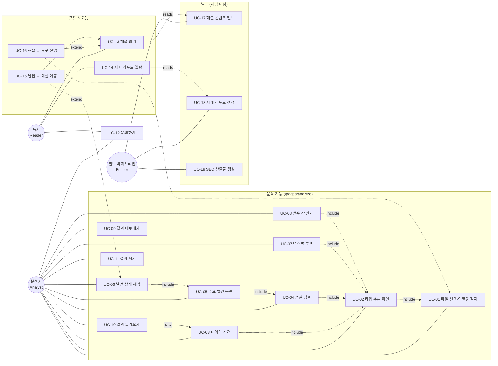

# 유스케이스

- 작성일: 2026-08-16
- 전제: [`direction.md`](./direction.md) 차별화 축·Phase, [`tech-stack.md`](./tech-stack.md) 스택·모듈, [`screens.md`](./screens.md) 화면 구성
- 범위: Phase 1·1.5는 상세 명세, Phase 2~3은 목록만. 미확정 기능을 상세히 쓰면 구현 전에 폐기될 가능성이 큼

---

## 1. 액터

| 액터 | 유형 | 설명 |
|---|---|---|
| **분석자 (Analyst)** | 주요·인간 | 자기 데이터를 분석하러 온 사용자. 로그인·계정 개념 없음 |
| **독자 (Reader)** | 주요·인간 | 개념을 검색해 유입된 사용자. 축 6의 진입점이며 **Analyst로 전환되는 것이 목표** |
| **빌드 파이프라인 (Builder)** | 보조·시스템 | 로컬 또는 GitHub Actions. 해설·사례·SEO 산출물을 생성해 커밋 |
| **LLM 제공자** | 보조·외부 | Phase 2 선택 기능. 사용자가 입력한 API Key로만 호출됨 |

> **`weareants`와의 결정적 차이: 계정·동기화 액터가 없음.** 백엔드가 없어 Guest / Linked User 구분이 성립하지 않으며, 모든 분석 유스케이스가 단일 액터에서 완결됨. 대신 Reader를 별도 액터로 세워 콘텐츠 유입 → 도구 전환 동선을 유스케이스 수준에서 드러냄.
>
> Reader와 Analyst는 상속 관계가 아니라 **같은 사람의 다른 시점**임. UC-16(해설 → 도구 진입)이 그 전환점이며, 이 전환율이 축 6의 성패를 결정함.

---

## 2. 유스케이스 다이어그램

Mermaid는 UML 유스케이스 표기를 직접 지원하지 않으므로 flowchart로 액터-유스케이스 관계를 표현함. 점선은 `«include»` / `«extend»` / `«reads»` 관계임.

**동선의 핵심**: `UC-06 → UC-15 → UC-13`(결과에서 해설로)과 `UC-13 → UC-16 → UC-01`(해설에서 도구로)이 순환을 이룸. 이 순환이 성립하려면 해설 페이지를 다녀와도 결과가 살아 있어야 하므로 `screens.md §5`의 sessionStorage 캐시가 필수 요건임.

---

## 3. 유스케이스 명세 — Phase 1

### UC-01 CSV 파일 선택 · 인코딩 자동 감지

| 항목 | 내용 |
|---|---|
| 액터 | Analyst |
| 목적 | 로컬 CSV를 브라우저에서 읽어 분석 가능한 열 단위 구조로 변환 |
| 선행조건 | `/pages/analyze` 진입 (상태 A) |
| 기본 흐름 | 1) 파일 선택 또는 드래그 앤 드롭 → 2) 상태 B 전환, Web Worker 기동 → 3) 바이트를 `TextDecoder('utf-8', {fatal:true})`로 시도 → 4) 실패 시 `TextDecoder('euc-kr')`로 폴백 → 5) 구분자 추정(`,` `;` `\t` `\|`) → 6) 헤더 판별 후 파싱 → 7) 열 단위 저장(수치는 `Float64Array`) → 8) UC-02로 진행 |
| 후행조건 | 파싱 결과가 메모리에 존재. **파일은 서버로 전송되지 않고 어디에도 저장되지 않음** |
| 대안 흐름 A | **인코딩 감지 실패** — UTF-8·EUC-KR 모두 판별 불가 → 상태 D에서 인코딩 수동 선택 제시 후 재시도 (축 5 요구사항) |
| 대안 흐름 B | **크기 초과** — 브라우저 메모리 한도 초과 예상 → 상태 D에서 행 수 제한 또는 열 선택 안내 |
| 대안 흐름 C | **파싱 불가** — 행별 열 수 불일치가 임계 이상 → 상태 D에서 어느 행이 문제인지 제시 |
| 규칙 | UTF-8 BOM을 제거하되 본문을 손상시키지 않음. 진행 중 UI가 멈추지 않아야 함(Worker 필수) |

### UC-02 컬럼 타입 추론 결과 확인

| 항목 | 내용 |
|---|---|
| 액터 | Analyst |
| 목적 | 열마다 수치·범주·날짜·불리언·ID·텍스트 중 하나를 정해 이후 모든 분석의 기준을 세움 |
| 선행조건 | UC-01 완료 |
| 기본 흐름 | 1) 열별 표본으로 타입 후보 판정 → 2) 고유값 비율로 ID성·범주형 구분 → 3) 날짜 포맷(`YYYY-MM-DD`, `YYYY년 M월` 등) 시도 → 4) 결과를 개요 섹션에 타입 배지로 표시 |
| 후행조건 | 열별 타입이 확정되어 UC-03·04·07·08의 입력이 됨 |
| 대안 흐름 | **추론이 틀린 경우** — 사용자가 열의 타입을 직접 변경 → **UC-03~08을 해당 열에 대해 재계산**. 우편번호·코드값이 수치로 잡히는 사례가 흔하므로 이 경로는 선택 기능이 아니라 필수임 |
| 규칙 | 추론 근거(고유값 수, 표본 값)를 함께 노출해 사용자가 판단할 수 있게 함 |

### UC-03 데이터 개요 확인

| 항목 | 내용 |
|---|---|
| 액터 | Analyst |
| 목적 | 데이터의 규모와 구성을 한 화면으로 파악 |
| 선행조건 | UC-02 완료 |
| 기본 흐름 | 1) 행·열 수, 타입별 열 분포, 메모리 추정치, 중복 행 수 산출 → 2) 개요 탭에 표시 → 3) 상위 N행 미리보기 제공 |
| 후행조건 | 없음 (읽기 전용) |
| 규칙 | 미리보기는 원본 값을 그대로 보여주므로 화면 밖으로 나가지 않음 |

### UC-04 데이터 품질 점검 (Health Score)

| 항목 | 내용 |
|---|---|
| 액터 | Analyst |
| 목적 | 결측·중복·상수 열·고카디널리티·이상치·유효하지 않은 값을 정량화해 **단일 점수와 항목별 판정**으로 집약 |
| 선행조건 | UC-02 완료 |
| 기본 흐름 | 1) 항목별 지표 산출 → 2) 항목마다 감점 규칙 적용 → 3) 총점(0~100)과 항목별 `✓ / ⚠` 표시 → 4) 각 항목에서 UC-05의 관련 발견으로 이동 |
| 후행조건 | 항목별 판정이 UC-05 Finding 생성의 원천이 됨 |
| 규칙 | **감점 규칙을 문서화해 임의 점수가 아님을 보장함** — 항목별 계산식·감점 상한·등급 구간은 [`rules.md §2`](./rules.md)가 단일 원천임. 점수만 보여주고 근거를 감추면 사전조사 §9.2의 취지에 반하므로 `evidence` 수치를 함께 노출함 |

### UC-05 주요 발견 목록 확인

| 항목 | 내용 |
|---|---|
| 액터 | Analyst |
| 목적 | 통계표를 읽지 않고도 확인할 사항을 **발견(Finding) 목록**으로 파악 (축 1) |
| 선행조건 | UC-04 완료 |
| 기본 흐름 | 1) 규칙 엔진이 통계 JSON을 평가해 Finding 객체 생성 → 2) 심각도·영향 범위로 정렬 → 3) 발견 탭에 목록 표시 → 4) 각 항목은 대상 열·수치·한 줄 요약을 가짐 |
| 후행조건 | Finding 목록이 UC-06·UC-09의 입력이 됨 |
| 대안 흐름 | **발견 0건** — "확인할 문제가 없음"을 명시하고 개요·분포로 유도. 빈 목록을 그대로 두지 않음 |
| 규칙 | 시각화 개수 상한과 같은 취지로 **표시 개수에 상한**을 둠 — 수치와 같은 유형 묶기 규칙은 [`rules.md §4`](./rules.md)가 단일 원천임. 50개 열의 모든 통계를 발견으로 승격하면 G2(정보 과부하)를 반복함 |

### UC-06 발견 상세 해석 열람

| 항목 | 내용 |
|---|---|
| 액터 | Analyst |
| 목적 | 발견마다 `무엇이 발견되었는지 / 왜 문제인지 / 무엇을 하면 되는지` 3단 해석을 확인 |
| 선행조건 | UC-05 완료 |
| 기본 흐름 | 1) 목록에서 항목 선택 → 2) 규칙 기반 한국어 해석 문구 표시 → 3) 관련 시각화 표시 → 4) ML 관점 경고가 있으면 함께 표시(다중공선성·데이터 누수 후보·클래스 불균형·대치 시 분포 왜곡) → 5) `자세히` 링크 노출 |
| 후행조건 | UC-15로 확장 가능 |
| 규칙 | 해석은 **결정론적 템플릿**으로 생성함 — 유형별 문구 템플릿과 금지 표현은 [`rules.md §5`](./rules.md) 참조. LLM 불필요이며 Phase 2의 AI 레이어와 무관하게 동작해야 함. **해설 페이지 본문과 문장을 공유하지 않음**(안티패턴 #4) |

### UC-07 변수별 분포 열람

| 항목 | 내용 |
|---|---|
| 액터 | Analyst |
| 목적 | 열 하나를 골라 기술통계와 분포를 확인 |
| 선행조건 | UC-02 완료 |
| 기본 흐름 | 1) 열 목록에서 선택 → 2) 타입별 통계 표시(수치: 평균·중위·표준편차·분위·왜도·첨도 / 범주: 고유값·최빈값·빈도) → 3) **타입에 맞는 차트 자동 선택**(수치 → 히스토그램+박스플롯, 범주 → 막대) → 4) 해당 열의 Finding을 함께 표시 |
| 후행조건 | 없음 |
| 규칙 | 기본 화면에서는 선별된 대표 열만 노출하고 전체는 목록에서 선택하게 함 — 노출 개수는 [`rules.md §4`](./rules.md) |

### UC-08 변수 간 관계 열람

| 항목 | 내용 |
|---|---|
| 액터 | Analyst |
| 목적 | 열 사이의 상관과 중요 관계를 확인 |
| 선행조건 | UC-02 완료. 수치형 열 2개 이상 |
| 기본 흐름 | 1) 상관행렬 산출(Pearson·Spearman 선택) → 2) 히트맵 표시 → 3) 상관 절댓값 상위 쌍을 **선별해** 산점도 제시 → 4) VIF 산출로 다중공선성 후보 표시 |
| 후행조건 | 높은 상관 쌍이 UC-05의 Finding 원천이 됨 |
| 대안 흐름 | 수치형 열이 2개 미만 → 관계 탭을 비활성화하고 이유를 표시 |
| 규칙 | 모든 쌍의 산점도를 그리지 않음(열 30개면 435쌍) — 산점도·히트맵 상한은 [`rules.md §4`](./rules.md) |

### UC-09 결과 JSON 내보내기

| 항목 | 내용 |
|---|---|
| 액터 | Analyst |
| 목적 | 백엔드가 없는 조건에서 분석 결과를 보존·재현·전달 |
| 선행조건 | UC-05 완료 |
| 기본 흐름 | 1) `결과 내보내기` 선택 → 2) [`data-model.md §3`](./data-model.md) 스키마로 직렬화 → 3) 파일 다운로드 |
| 후행조건 | 사용자가 파일을 보유. UC-10의 입력이 됨 |
| 규칙 | **원본 데이터 행을 포함하지 않음** — 집계값과 발견만 담음. 미리보기 행과 원본 파일명도 제외 |

### UC-10 결과 JSON 불러오기

| 항목 | 내용 |
|---|---|
| 액터 | Analyst |
| 목적 | 내보낸 결과를 다시 열어 UC-03~08과 동일한 화면으로 확인 |
| 선행조건 | `/pages/analyze` 진입 (상태 A) |
| 기본 흐름 | 1) `결과 불러오기`로 JSON 선택 → 2) `schemaVersion`·필수 필드 검증([`data-model.md §3·§4`](./data-model.md)) → 3) 상태 C로 직행 → 4) UC-03~08 화면 구성 |
| 후행조건 | 결과가 sessionStorage에 캐시됨 |
| 대안 흐름 | **스키마 불일치·버전 상이** — 거부하고 어느 필드가 문제인지 제시. 부분 복원을 시도하지 않음(잘못된 화면을 보여주는 것이 더 나쁨) |
| 규칙 | 원본 데이터가 없으므로 타입 변경(UC-02 대안)·재계산은 불가함을 화면에 명시 |

### UC-11 분석 결과 폐기

| 항목 | 내용 |
|---|---|
| 액터 | Analyst |
| 목적 | 로컬에 남은 결과를 사용자가 직접 지움 |
| 선행조건 | sessionStorage에 결과 존재 |
| 기본 흐름 | 1) `결과 지우기` 선택 → 2) 확인 → 3) `autoeda:result` 삭제 → 4) 상태 A로 복귀 |
| 후행조건 | 로컬에 결과가 남지 않음 |
| 규칙 | 개인정보처리방침에 "사용자가 직접 삭제할 수 있다"고 기재하므로 **이 경로가 실제로 존재해야 함**. 문구와 구현의 불일치를 만들지 않음 |

### UC-12 문의하기

| 항목 | 내용 |
|---|---|
| 액터 | Analyst / Reader |
| 목적 | 백엔드 없이 문의를 전달 |
| 선행조건 | `/pages/contact` 진입 |
| 기본 흐름 | 1) 문의 유형 선택 → 2) 유형에 따라 메일 제목·본문 자동 조립 → 3) `mailto:` 링크로 메일 앱 실행 |
| 대안 흐름 | 메일 앱이 없을 때 주소를 노출하고 복사 버튼 + 본문 미리보기를 제공 (`BDAnalyzer/pages/contact.html` 패턴) |
| 규칙 | **업로드한 데이터·결과를 문의에 자동 첨부하지 않음.** 서버 전송 없음이라는 전제를 문의 경로에서 깨뜨리지 않음 |

## 4. 유스케이스 명세 — Phase 1.5

### UC-13 해설 문서 읽기

| 항목 | 내용 |
|---|---|
| 액터 | Reader |
| 목적 | 검색으로 들어온 독자가 개념 하나를 이해 |
| 선행조건 | `/pages/guide` 또는 `/pages/guide/{slug}` 진입 (주로 검색 유입) |
| 기본 흐름 | 1) 빌드 시점에 생성된 정적 HTML 열람 → 2) 개념 설명·판단 기준·예시 확인 → 3) 하단에서 관련 해설·사례 리포트로 이동 → 4) `내 데이터로 확인하기` CTA 노출 |
| 후행조건 | UC-16으로 확장 가능 |
| 규칙 | 콘텐츠가 **초기 HTML에 존재**해야 함. JSON을 런타임에 fetch해 그리면 색인 코퍼스가 생기지 않음 |

### UC-14 사례 리포트 열람

| 항목 | 내용 |
|---|---|
| 액터 | Reader |
| 목적 | 업로드·설치 없이 완성된 분석 결과를 보고 도구의 산출물을 판단 |
| 선행조건 | `/pages/case` 또는 `/pages/case/{slug}` 진입 |
| 기본 흐름 | 1) 정적 HTML 열람 → 2) 데이터셋 설명·Health Score·Finding·해석 확인 → 3) 등장한 발견 유형의 해설로 이동 → 4) `내 데이터로 확인하기` CTA |
| 후행조건 | UC-16으로 확장 가능 |
| 규칙 | 통계 나열이 아니라 **해석과 판단이 본문의 주(主)** 여야 함 — 안티패턴 #1(외부 데이터 재포장) 회피 |

### UC-15 발견 → 해설 이동 «extend» UC-06

| 항목 | 내용 |
|---|---|
| 액터 | Analyst |
| 목적 | 결과 화면에서 만난 개념을 그 자리에서 학습 |
| 선행조건 | UC-06에서 발견 상세를 열람 중 |
| 기본 흐름 | 1) `자세히` 선택 → 2) `data/finding-map.json`에서 Finding 유형에 대응하는 해설 URL 조회 → 3) 해당 해설 페이지로 이동 |
| 부가 흐름 | 발견이 아닌 **화면 고정 안내**(관계 탭의 범주형↔수치형 안내)도 같은 `자세히` 링크를 씀 — 유형 매핑 대신 슬러그를 직접 지정하고 발행 게이트(`data/published.json`)는 같은 것을 탐 |
| 후행조건 | 브라우저 뒤로가기로 복귀 시 **sessionStorage에서 결과가 복원되어 같은 위치를 다시 봄** |
| 대안 흐름 | 매핑이 없는 Finding 유형 → `자세히` 링크를 렌더하지 않음(빈 링크를 만들지 않음) |
| 규칙 | 모든 Finding 유형이 대응 해설을 1:1로 가져야 함 (`content-strategy.md §2`의 "대응 Finding" 열이 원천). 역방향은 요구하지 않음 — 대응 Finding 없이 화면 안내에서만 도달하는 해설이 있음(R4, [`rules.md §6.3`](./rules.md)) |

### UC-16 해설 → 도구 진입 «extend» UC-13

| 항목 | 내용 |
|---|---|
| 액터 | Reader → Analyst |
| 목적 | 개념을 이해한 독자를 도구 사용자로 전환. **축 6의 성패를 결정하는 지점** |
| 선행조건 | UC-13 또는 UC-14 열람 중 |
| 기본 흐름 | 1) `내 데이터로 확인하기` 선택 → 2) `/pages/analyze` 이동 → 3) UC-01 시작 |
| 후행조건 | Analyst로 전환됨 |
| 규칙 | CTA를 모든 해설·사례 페이지 하단에 고정 배치함. 광고와 시각적으로 구분해 CTA가 광고로 오인되지 않게 함 |

### UC-17 해설 콘텐츠 빌드

| 항목 | 내용 |
|---|---|
| 액터 | Builder |
| 목적 | 사람이 작성한 원자료를 색인 가능한 정적 HTML로 변환 |
| 선행조건 | `data/guide_source/*.md` 존재 |
| 기본 흐름 | 1) `scripts/build_guides.mjs` 실행 → 2) md 파싱·서식 검증 → 3) `pages/guide/{slug}.html` 생성 → 4) `/pages/guide` 인덱스 목록 갱신 → 5) 렌더 텍스트 분량 집계 출력 |
| 후행조건 | 정적 HTML이 커밋 대상이 됨 |
| 대안 흐름 | **서식 오류 발견 시 파일을 쓰지 않고 종료 코드 1로 실패** — 어긋난 줄을 조용히 흘려보내면 내용이 통째로 사라짐 (`BDAnalyzer/scripts/build_notes.py` 정책) |
| 규칙 | 편당 800자 미달 문서는 경고를 출력함. 누적 분량을 목표(25,000자)와 함께 표시 |

### UC-18 사례 리포트 생성

| 항목 | 내용 |
|---|---|
| 액터 | Builder |
| 목적 | 공개 데이터셋 분석 결과를 정적 HTML로 발행 |
| 선행조건 | 공개 데이터셋 확보, 이용 조건 확인 완료 |
| 기본 흐름 | 1) [`data-sources.md §7`](./data-sources.md) 이용 조건 판정 → 2) `js/worker/analyze.worker.js` 의 `analyze` 를 Node 에서 돌려 지표 산출 → 3) 사람이 해석 원고를 `data/case_source/{slug}.md` 로 작성하고 지표를 표에 옮김 → 4) `npm run build` 가 `pages/case/{slug}.html` 생성 |
| 후행조건 | 정적 HTML이 커밋 대상이 됨 |
| 규칙 | **자동 생성 결과를 그대로 발행하지 않음.** 해석 원고 없이 지표만 있는 사례는 발행 대상이 아님 — 안티패턴 #2(프로그램 생성 페이지 대량 발행) 회피 |

### UC-19 SEO 산출물 생성

| 항목 | 내용 |
|---|---|
| 액터 | Builder |
| 목적 | canonical·OG·JSON-LD·sitemap을 단일 원천에서 생성해 수기 관리에서 오는 불일치를 없앰 |
| 선행조건 | 페이지 목록(`screens.md §2`)이 스크립트 내 상수로 존재 |
| 기본 흐름 | 1) `scripts/build_seo.mjs` 실행 → 2) 페이지별 canonical·meta·OG 주입 → 3) 구조화 데이터 삽입 → 4) `sitemap.xml` 생성 |
| 후행조건 | sitemap에 정책 페이지 4종과 결과 화면이 포함되지 않음 |
| 규칙 | **모든 URL을 확장자 없이 출력함.** `.html`을 가리키면 307 리디렉션으로 색인이 거부됨 (`tech-stack.md §6`) |

### UC-25 용어집 열람

Phase 3 목록에 있던 항목이나 해설 15편 발행 이후 진입 비용이 큰 것으로 확인되어 앞당겨 구현함.

| 항목 | 내용 |
|---|---|
| 액터 | 분석자 |
| 목적 | 결과 화면에 나온 용어 하나의 뜻과 판정 기준을 해설 전편을 읽지 않고 확인 |
| 선행조건 | 없음. 도구 사용 여부와 무관하게 열람 가능 |
| 기본 흐름 | 1) 상단 네비·전역 메뉴·해설 페이지에서 `/pages/glossary` 진입 → 2) 상단 '빠른 이동'에서 용어 선택 → 3) 해당 항목으로 앵커 이동 → 4) 필요하면 관련 해설로 이동 |
| 후행조건 | 없음(열람 전용) |
| 규칙 | 항목마다 **이 도구가 쓰는 판정 수치**를 함께 적음. 임계값은 [`rules.md §2·§3`](./rules.md)가 단일 원천이며 용어집이 값을 재정의하지 않음. 관련 해설 링크는 발행된 해설만 가리키며, 없는 슬러그는 빌드가 실패함 |

## 5. 유스케이스 목록 — Phase 2~3

상세 명세는 착수 시점에 작성함. 미확정 기능을 지금 명세하면 확정 사항처럼 굳어짐.

| UC | 제목 | Phase | 예상 화면 |
|---|---|---|---|
| UC-20 | 단계별 분석 가이드 진행 (STEP 흐름) | 2 | `/pages/analyze` 상태 C의 진행 모드 |
| UC-21 | 타깃 변수 지정 기반 EDA | 2 | 상태 C에 타깃 탭 추가 |
| UC-22 | AI 해석 요청 (사용자 API Key) | 2 | 상태 C의 선택 패널 |
| UC-23 | 리포트 내보내기 (HTML/PDF) | 2 | 상태 C |
| UC-24 | 대용량 샘플링 동의 | 2 | 상태 B |
| UC-26 | AI 질의응답 | 3 | 상태 C |
| UC-27 | 두 데이터셋 비교 | 3 | 신규 화면 |
| UC-28 | 결과 링크 공유 | 3 | Cloudflare D1 도입이 전제 |

## 6. 추적 매트릭스

Domain 열은 [`tech-stack.md §5`](./tech-stack.md)의 모듈명과 일치해야 함. 불일치는 둘 중 하나가 틀렸다는 신호임.

| UC | 페이지 | Presentation | Domain | 저장 |
|---|---|---|---|---|
| UC-01 | `/pages/analyze` | `analyze.page.js` | `decode.js` · `parse.js` | — (메모리) |
| UC-02 | `/pages/analyze` | `analyze.page.js` | `infer.js` | — |
| UC-03 | `/pages/analyze` | `analyze.page.js` | `stats.js` | `autoeda:result` |
| UC-04 | `/pages/analyze` | `analyze.page.js` | `quality.js` | `autoeda:result` |
| UC-05 | `/pages/analyze` | `analyze.page.js` | `finding.js` | `autoeda:result` |
| UC-06 | `/pages/analyze` | `analyze.page.js` | `finding.js` · `chart-select.js` · `chart-svg.js` | — |
| UC-07 | `/pages/analyze` | `analyze.page.js` | `stats.js` · `outlier.js` · `chart-select.js` · `chart-svg.js` | `autoeda:prefs` |
| UC-08 | `/pages/analyze` | `analyze.page.js` | `correlation.js` · `chart-svg.js` | `autoeda:prefs` |
| UC-09 | `/pages/analyze` | `analyze.page.js` | — | 파일 다운로드 |
| UC-10 | `/pages/analyze` | `analyze.page.js` | — (스키마 검증) | `autoeda:result` |
| UC-11 | `/pages/analyze` | `analyze.page.js` | — | `storage/local.js` |
| UC-12 | `/pages/contact` | `contact.page.js` | — | — |
| UC-13 | `/pages/guide`, `/pages/guide/{slug}` | `common.js` (정적 HTML) | — | — |
| UC-14 | `/pages/case`, `/pages/case/{slug}` | `common.js` (정적 HTML) | — | — |
| UC-15 | `/pages/analyze` → `/pages/guide/{slug}` | `analyze.page.js` | `finding.js` | `data/finding-map.json` |
| UC-16 | `/pages/guide/{slug}` → `/pages/analyze` | `common.js` | — | — |
| UC-17 | (빌드) | — | `scripts/build_guides.mjs` | `data/guide_source/*.md` |
| UC-18 | (빌드) | — | `scripts/build_guides.mjs` + `analyze` 실측 | 공개 데이터셋 |
| UC-19 | (빌드) | — | `scripts/build_seo.mjs` | `sitemap.xml` |

**모든 분석 UC가 `analyze.page.js` 하나에 몰리는 이유**: 도구가 단일 페이지 4상태 구조이기 때문임(`screens.md §4`). 이 파일이 과대해지면 상태별 렌더 모듈로 분할하되, **`js/domain/*`는 DOM을 참조하지 않는 계약을 유지함** — 분할은 Presentation 내부 문제로 한정함.

**Worker 경유**: UC-01~05는 `js/worker/analyze.worker.js`에서 실행되고 `analyze.page.js`는 메시지로 결과를 받음. 위 표의 Domain 모듈은 Worker 안에서 import됨.
